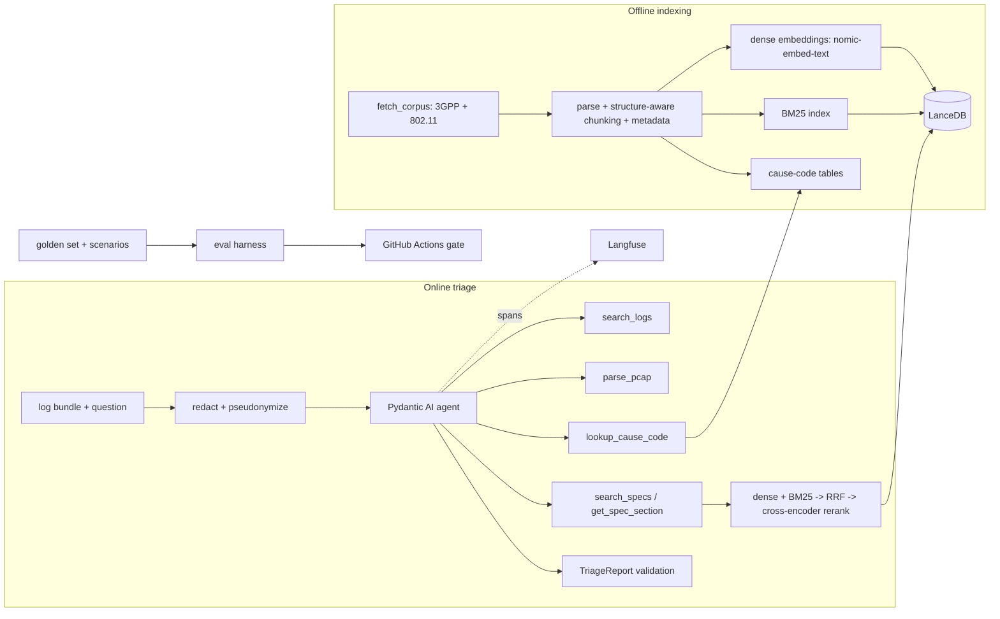

# Project Brief: Wireless Log Triage Agent (Agentic RAG for Wi-Fi and Cellular Failures)

## 0. Your role and how we work

You are a senior ML-systems engineer pair-programming with me. I am an M.Tech (IT) student building this project for Apple's Wireless Technology & Ecosystems (WTE) AI/ML + Software Engineering internship interviews. I must be able to explain and defend every design decision, so the process matters as much as the code.

1. **One phase at a time** (Section 5). At the end of each phase, stop and give me:
   - what changed and why
   - alternatives you rejected, and the reason
   - how I can verify it myself
   - 3 questions an interviewer is likely to ask about this phase, with short answers

   Append the same to `docs/DESIGN_NOTES.md`. Wait for my "go" before starting the next phase.
2. **Let me make the trade-off decisions.** When a choice matters (chunking, BM25 library, reranker, RRF k, thresholds, tool budget), show me 2–3 options with pros and cons and let me pick. Don't decide silently.
3. **Small commits.** Keep commits small and reviewable, with clear messages.
4. **Never invent numbers.** Every metric in the README or on my resume must come from a command in this repo whose output JSON is committed under `results/`. If something can't be measured, say so.
5. **Keep code simple.** Prefer boring, explainable code over clever code. Use type hints everywhere, keep `ruff` clean, and write `pytest` tests for every non-trivial function.
6. **Check library APIs before using them.** Before calling Pydantic AI, LanceDB, Langfuse, sentence-transformers or Scapy, check the version pinned in `pyproject.toml`/`uv.lock` and use that version's API. If unsure, tell me instead of guessing.
7. **Don't trust memory for spec facts.** Verify every telecom fact (cause codes, reason codes, section numbers, timers) against the spec text in the corpus.

---

## 1. Context

**Upstream:** this is a fork of `amscotti/local-LLM-with-RAG` (MIT license). It is already an agentic RAG app:
- a Pydantic AI agent with tool calling over local Ollama models
- `nomic-embed-text` embeddings stored in LanceDB
- MarkItDown for document loading, and a Streamlit UI
- a `bench/` eval harness with an LLM judge
- a 4-search cap per question

Keep the MIT license and upstream copyright notice, and credit upstream at the top of the README.

**My machine:** macOS, 8GB RAM, CPU-only, Python 3.13. Everything must run locally on this machine, and all models must be configurable.

**Time budget:** 4 weeks, about 10 hours/week. Deadline: 2026-10-26.

**What the finished system does:**
- **Input:** a *log bundle* (text device logs, plus an optional `.pcap`) and a question such as "Why does this phone keep dropping Wi-Fi?"
- **What the agent does:** it searches the logs, parses the capture, and retrieves the relevant 3GPP / IEEE 802.11 sections.
- **Output:** a validated, structured root-cause report that cites exact spec sections and exact log lines or pcap frames.
- **Privacy:** sensitive identifiers are redacted before anything is indexed, sent to a model, or traced.

**Target resume bullets.** Fill in X, Y and Z only from real results:
- Extended an open-source agentic RAG system to 3GPP specs and device logs with hybrid BM25 + dense retrieval, RRF fusion and cross-encoder reranking, raising Recall@10 from X% to Y% on a Z-question test set.
- Built typed tools (log search, pcap parsing, spec lookup) returning Pydantic-validated root-cause reports with spec-section citations; redacted MAC/IMSI/IMEI before indexing.
- Added Langfuse tracing and a GitHub Actions eval gate that fails the build on retrieval regressions.

---

## 2. Target architecture



**Proposed layout.** Extend the upstream code rather than rewriting it, and adapt this layout to upstream's structure after Phase 0:

```
core/
  ingest/      fetch_corpus.py, parse_3gpp.py, chunking.py, manifest
  redact/      detectors, pseudonymizer, redaction report
  retrieval/   dense.py, sparse.py, fusion.py (RRF), rerank.py, pipeline.py
  tools/       search_specs, get_spec_section, lookup_cause_code, search_logs, parse_pcap
  schemas.py   Pydantic models (tool I/O, TriageReport)
  agent.py     extends the upstream agent
eval/
  golden/      dev.jsonl, test.jsonl
  metrics.py, retrieval_eval.py, e2e_eval.py, compare.py
scenarios/     seeded synthetic log/pcap generator + labelled scenarios
results/       committed metric JSONs (the only source of truth for numbers)
tests/
docs/          PROJECT_BRIEF.md, DESIGN_NOTES.md
```

---

## 3. Corpus

Keep the corpus focused, because depth beats breadth.

- **Cellular (3GPP, free download from 3gpp.org):**
  - TS 24.301: LTE NAS (attach, TAU, EMM cause values)
  - TS 24.501: 5G NAS (registration, 5GMM cause values)
  - Optional later: TS 23.401 and TS 23.502 procedure specs
  - Pin the exact release and version of each spec.
- **Wi-Fi:** IEEE 802.11, free via the IEEE GET Program (account required). Use only the clauses on reason codes, status codes, association, and the RSNA 4-way handshake. I will download it manually to `/Users/sayantansikdar/Developer/80211_spec`.
- **Do not commit spec text to the repo.** Instead, write `core/ingest/fetch_corpus.py`, which should:
  - download the pinned 3GPP versions, or read 802.11 from the local path
  - verify SHA-256 checksums
  - write `corpus_manifest.json` recording source, version, checksum, ingestion timestamp and parser version

  The corpus version is the hash of the manifest.

---

## 4. Evaluation design (build this before improving anything)

### Retrieval golden set
- **Format:** JSONL, one question per line, with these fields: `id, split (dev|test), category, question, gold_sections [{spec, version, section}], notes, verified_by`.
- **Label at section level, not chunk level.** Then changing the chunking never invalidates the labels. To score, map each retrieved chunk to its section.
- **Size and splits:** about 60 questions.
  - ~20 in **dev**, used for tuning.
  - ~40 in **test**, used only for reported numbers. Never tune on the test split.
- **Question styles:** mix three styles in roughly equal parts.
  - (a) Direct lookup: "What does EMM cause #15 mean?"
  - (b) Symptom-based paraphrase with little word overlap: "The phone is rejected every time it enters a new area. What is the network telling it?"
  - (c) Log-snippet queries: a redacted log line pasted in as the question.
- **Who writes it:** you may *draft* candidate questions, but I write or verify each one and its gold section myself. Flag any draft that copies wording from its gold section, because that artificially inflates BM25 scores.

### Retrieval metrics
- **Recall@10:** define it precisely as the fraction of questions with at least one gold section in the top 10. Also report per-gold-section recall.
- **Ranking quality:** MRR@10 and nDCG@10.
- **Latency:** p50 and p95 for each stage (dense, sparse, fusion, rerank).
- **Confidence intervals:** report 95% paired-bootstrap intervals. With only ~40 test questions, small differences may be noise, and I need to be able to say that honestly.

### Results format
Every run writes `results/<run_name>.json` containing:
- aggregate metrics and per-question scores
- the full config
- the git SHA and corpus version
- model names and Ollama model digests

### End-to-end scenario metrics (Phase 5)
Score each scenario on:
- root-cause category accuracy
- **citation validity:** every cited section was actually retrieved in that session
- citation correctness against the gold sections
- schema-valid rate
- correct abstention on ambiguous cases
- tool calls per run, and latency

For faithfulness, use the upstream LLM judge. I will hand-check about 20% of the judged outputs to measure how far the judge can be trusted.

---

## 5. Phases

### Phase 0: Recon (no code changes)
Read `CLAUDE.md`, `core/`, `interfaces/`, `bench/` and `.github/workflows/`, then explain to me:
- how documents are loaded and chunked
- how embeddings are created, including whether nomic's `search_query:` / `search_document:` task prefixes are used
- how the agent decides when to search, and where the search cap lives
- how `bench/` scores answers

Then propose the adapted layout and phase plan.

**Done when:** I have approved the plan.

### Phase 1: Corpus and baseline freeze
- Implement `fetch_corpus.py` and the manifest.
- Index the corpus through the **unmodified** upstream loading, chunking and embedding path.
- Tag the commit `baseline-v0`.

**Done when:** the baseline index builds reproducibly from one command.

### Phase 2: Golden set, retrieval eval, baseline numbers
- Build `metrics.py` with unit tests that use hand-computed examples for Recall@k, MRR and nDCG.
- Build `retrieval_eval.py`.
- Help me build the golden set.
- Run upstream dense retrieval on the test split and save `results/baseline_dense.json`. **This is X.**

**Done when:** the baseline numbers are committed and I can explain each metric by hand.

### Phase 3: Structure-aware ingestion, metadata, redaction

**Parsing and chunking:**
- Parse the 3GPP `.docx` files (inside the zips) preserving the heading hierarchy.
- Chunk by section (for example "5.5.1.2.5 Attach not accepted by the network").
- Keep tables intact. Cause-code tables must never be split.
- Store per-chunk metadata: spec, release/version, section number, section title, parent section, doc type, chunk_id and corpus version.
- Extract the cause, reason and status code tables into a structured lookup table. This extraction must be deterministic code, not an LLM. The table feeds `lookup_cause_code`.

**Redaction module.** It applies to everything user-provided: logs, pcap summaries and queries.
- **What it detects:**
  - MAC addresses in colon, hyphen and dotted formats
  - IMSI: 15 digits, context-keyed (for example `imsi=`)
  - IMEI: 15 digits with a valid Luhn check digit, context-keyed
  - Configurable extras: IPs, phone numbers, emails, SSIDs
- **Consistent pseudonymization, not blanket `[REDACTED]`.** Replace each value with a keyed-HMAC token such as `MAC_7f3a`, so the agent can still tell that two lines refer to the same device or AP. The key comes from an environment variable and is never committed.
- **Audit report:** produce a redaction report per bundle with counts by type and no raw values.
- **Tests:**
  - positive cases
  - false-positive traps: timestamps, 15-digit counters, hex dumps
  - Luhn edge cases
  - idempotency: redacting twice gives the same output

**Ablation:** re-run the retrieval eval with *only* the chunking change. If upstream lacked the nomic prefixes, add them as a separate ablation row so each gain is attributed correctly.

**Done when:** the ablation rows are committed and all redaction tests pass.

### Phase 4: Hybrid retrieval, RRF, reranking
- **Sparse retrieval:** BM25, via either LanceDB's native full-text search or `bm25s` / `rank_bm25`. Show me the trade-off. Check that tokenization keeps telecom tokens intact (`T3410`, `5GMM`, `#15`, `EAPOL`, section numbers like `5.5.1.2.5`), and add tests for this.
- **Fusion:** implement RRF myself in `fusion.py`, using `score(d) = Σ 1 / (k + rank_i(d))`. Test it against hand-worked examples. Compare with LanceDB's built-in hybrid search only as a sanity check.
- **Reranking:** pass the top-50 fused candidates to a cross-encoder and keep the top 10. Measure both options:
  - `cross-encoder/ms-marco-MiniLM-L-6-v2`: fast
  - `BAAI/bge-reranker-v2-m3`: stronger but slower
- **Optional:** deterministic query parsing that extracts cause codes, timers and spec IDs and applies metadata filters.
- **Tuning:** tune RRF k, candidate depth and the reranker choice **on dev only**, then do one final run on test.
- **Ablation table** (test split, with CIs and latency):
  1. upstream dense
  2. \+ structure-aware chunking
  3. BM25 only
  4. hybrid RRF
  5. hybrid RRF + rerank

  **This gives Y and Z.**
- The README tables must be generated from `results/*.json` by a script. They are never hand-typed.

**Done when:** every ablation row exists in `results/` and the README table regenerates from one command.

### Phase 5: Typed tools, structured reports, scenarios

**Scenario generator** (`scenarios/generate.py`, seeded). Each scenario produces a log bundle, an optional pcap, and a ground-truth label (category, root cause, gold sections).
- **Log formats:**
  - wpa_supplicant-style lines, e.g. `CTRL-EVENT-DISCONNECTED ... reason=15`, `CTRL-EVENT-ASSOC-REJECT ... status_code=17`
  - logcat-style telephony lines
  - modem-style NAS trace lines
- **Pcaps:** build them with Scapy: 802.11 deauth/disassoc frames with reason codes, association responses with status codes, and EAPOL handshake frames. Add a few public Wireshark sample captures for realism.
- **Noise and fake identifiers:** inject noise lines, test-PLMN IMSIs (starting `00101`), Luhn-valid fake IMEIs, and random MACs.
- **Scenario list** (~25). Verify every code against the spec text.
  - Wi-Fi:
    - wrong PSK → 4-way handshake timeout
    - AP at capacity → association reject
    - inactivity disassociation
    - 802.1X authentication failure
  - Cellular:
    - attach reject with EMM causes such as #3, #7, #11 and #15
    - 5GMM registration reject
    - T3410 expiry
  - DHCP timeout. This is not a spec issue, so the correct report cites no spec section.
  - Two ambiguous cases where the correct output is low confidence or abstention.
  - One **adversarial** case where an SSID or log field contains a prompt-injection string.

**Tools.** Every tool gets:
- Pydantic input and output models
- bounded output size and timeouts
- per-tool call caps

Replace upstream's 4-search cap with a total budget of about 8 calls, and justify the number.

| Tool | What it does |
|---|---|
| `search_specs(query, filters)` | Runs the hybrid pipeline; returns chunk_ids, sections, scores |
| `get_spec_section(spec, section)` | Returns the exact section text |
| `lookup_cause_code(domain, code)` | Reads the structured table; domains are 802.11 reason, 802.11 status, EMM, 5GMM |
| `search_logs(pattern_or_query, time_window, level)` | Runs regex + BM25 over redacted log windows; returns line numbers |
| `parse_pcap(path, filter)` | Calls tshark via subprocess (argument list, no shell, path allowlist, timeout); returns summarized frames: number, time, type/subtype, reason/status code, EAPOL message number |

**Output schema.** `TriageReport`, produced via Pydantic AI structured output:
```
summary: str
category: enum (association, authentication, handshake, dhcp, attach_registration, mobility, other)
root_cause: str
confidence: float (0–1)
evidence: list[{source: log|pcap, line_or_frame: int, redacted_excerpt: str}]
citations: list[{spec, version, section, chunk_id}]
next_steps: list[str]
open_questions: list[str]
abstained: bool
```

**Validators:**
- Every `chunk_id` must appear in this session's retrieval log. This blocks invented citations.
- Every cited line or frame must exist in the bundle.
- A report with no citations that has not abstained is invalid, unless the category legitimately needs no spec (as in the DHCP case).
- On validation failure, retry once. If it fails again, return an abstention.

**Prompt-injection defense:** treat all tool output as untrusted data. Wrap it in clear delimiters, and instruct the model that log or pcap content can never issue instructions. The adversarial scenario must pass.

Run the end-to-end eval and save `results/e2e_*.json`.

**Done when:** the end-to-end results are committed and I can walk through one scenario's full tool-call sequence.

### Phase 6: Langfuse tracing
- Self-host Langfuse with docker compose.
- Export Pydantic AI's OpenTelemetry spans to Langfuse. Check the current Langfuse docs for the Pydantic AI integration.
- Add custom spans for dense, sparse, fusion and rerank, recording candidate counts and top scores. Also add spans for each tool call and for the validation outcome.
- For eval runs, attach eval scores to the traces.
- **Only redacted data may reach traces.** Add a test that exports the traces from an end-to-end run and fails if any raw MAC/IMSI/IMEI pattern appears.
- Document one real failed query from start to finish: trace → diagnosis → fix → re-measured result.

**Done when:** the PII-in-traces test passes and the failure case study is written up.

### Phase 7: CI eval gate (GitHub Actions)
- **`ci.yml`** runs on push and PR:
  - `ruff`, `pytest`, then the retrieval eval on the golden set
  - `eval/compare.py` compares the results against the committed `results/baseline_ci.json` and exits non-zero if Recall@10 drops more than [2] points or MRR@10 drops more than [0.02]
  - The thresholds are configurable. Document the tolerance used for run-to-run nondeterminism.
- **Caching:** cache Ollama models, Hugging Face models, the corpus (key = manifest hash) and the index. The retrieval eval must not need the chat LLM.
- **`e2e.yml`:** a manual or nightly full end-to-end eval. It is heavier and optional.
- **Prove the gate works:** open a PR that deliberately breaks fusion; it must fail CI. Link that PR in the README.

**Done when:** CI is green on main and the deliberately broken PR shows red.

### Phase 8 (stretch, only after Phases 0–7): C++ hot path
- Reimplement the log tokenizer and redactor in C++17, exposed to Python via pybind11.
- Add a property-based test (hypothesis) proving the C++ and Python versions produce identical output.
- Benchmark throughput on about 1M log lines and commit the results.

### Phase 9: Documentation
The README should cover:
- upstream credit, and exactly what I added
- the architecture diagram
- one-command reproduction
- the generated results tables with CIs
- the traced failure case study
- limitations: synthetic logs, a small test set, judge bias, and the spec subset
- what I would do next

---

## 6. Definition of done
- [ ] Baseline and all ablation rows reproducible from commands, with JSON in `results/`
- [ ] Test split never used for tuning (dev/test separation documented)
- [ ] Redaction tests pass; the PII-in-traces test passes
- [ ] All tools have typed I/O, timeouts, output bounds and call caps
- [ ] `TriageReport` validators block citations that weren't retrieved
- [ ] The injection scenario passes
- [ ] The CI gate is green on main and was shown failing on a deliberately broken PR
- [ ] `DESIGN_NOTES.md` has an entry for every phase, each with interview Q&A
- [ ] README credits upstream and lists limitations honestly

## 7. Which phases produce which resume bullet
- **Bullet 1** (hybrid retrieval, X→Y on Z): Phases 1–4
- **Bullet 2** (typed tools, validated reports, redaction): Phases 3 and 5
- **Bullet 3** (tracing, CI gate): Phases 6–7
